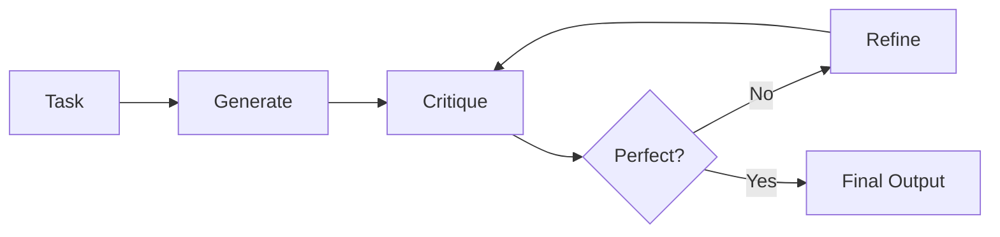
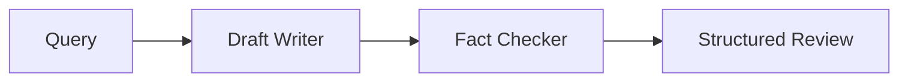
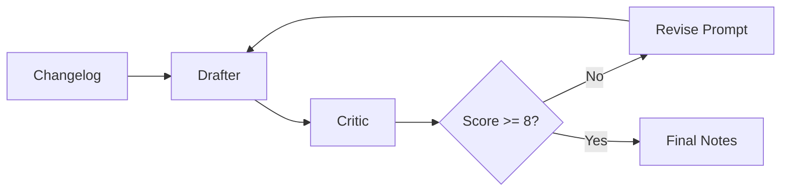

# Reflection Design Pattern for AI Agents

This folder contains three different implementations of the **Reflection Design Pattern**, a powerful AI agent architecture where agents iteratively improve their outputs through self-critique and refinement.

## 🔍 Overview

The Reflection Design Pattern involves:
1. **Generation**: An agent produces initial output
2. **Reflection/Critique**: Another agent (or the same agent) evaluates the output
3. **Refinement**: Based on the critique, the output is improved
4. **Iteration**: This process repeats until satisfactory results are achieved

## 📁 Files Description

### 1. `reflection_ex_01.py` - LangChain Basic Reflection Loop
**Framework**: LangChain with ChatGroq/ChatOpenAI  
**Use Case**: Python function generation with iterative improvement

**Key Features**:
- Multi-step reflection loop (max 3 iterations)
- Generates a `calculate_factorial` function
- Uses conversation history to maintain context
- Senior engineer persona for code review
- Automatic stopping when code is deemed perfect

**Architecture**:
```
Task Prompt → Generate Code → Reflect/Critique → Refine Code → Repeat
```

**Example Run**:
```python
python reflection_ex_01.py
```

### 2. `reflection_ex_02.py` - Google ADK Sequential Agents
**Framework**: Google AI Development Kit (ADK)  
**Use Case**: Fact-checking pipeline with draft generation and review

**Key Features**:
- Sequential agent pipeline
- Draft writer + fact checker agents
- Structured output with status and reasoning
- Event-driven execution model
- In-memory session management

**Architecture**:
```
User Query → DraftWriter → FactChecker → Structured Review
```

**Agents**:
- **DraftWriter**: Generates informative paragraphs
- **FactChecker**: Reviews content for accuracy

### 3. `reflection_ex_03.py` - Advanced Agent Framework with Structured Output
**Framework**: Custom agents framework with Groq/OpenAI  
**Use Case**: Release notes generation and improvement

**Key Features**:
- Pydantic models for structured critique
- Async/await pattern for performance
- Score-based stopping criteria (target score: 8/10)
- Detailed critique with strengths, issues, and improvements
- Professional release notes generation

**Architecture**:
```
Changelog → Drafter Agent → Critic Agent → Scored Critique → Iterate
```

**⚠️ Current Issues**:
- Groq model compatibility with JSON schema
- See [troubleshooting section](#troubleshooting) for solutions

## 🚀 Getting Started

### Prerequisites

```bash
pip install -r requirements.txt
```

Required packages:
- `langchain-openai`
- `langchain-groq` 
- `python-dotenv`
- `pydantic`
- `openai`
- `asyncio`
- `google-adk-agents` (for ex_02)

### Environment Setup

Create a `.env` file with your API keys:

```env
OPENAI_API_KEY=your_openai_key_here
GROQ_API_KEY=your_groq_key_here
GOOGLE_API_KEY=your_google_key_here
```

### Running the Examples

```bash
# Basic LangChain reflection
python reflection_ex_01.py

# Google ADK sequential agents
python reflection_ex_02.py

# Advanced agent framework (see troubleshooting first)
python reflection_ex_03.py
```

## 🛠 Troubleshooting

### `reflection_ex_03.py` Issues

**Problem**: Groq model doesn't support JSON schema
```
openai.BadRequestError: This model does not support response format `json_schema`
```

**Solutions**:

1. **Use compatible Groq model**:
```python
llm = OpenAIChatCompletionsModel(model="llama-3.1-70b-versatile", openai_client=groq_client)
```

2. **Switch to OpenAI**:
```python
openai_client = AsyncOpenAI(api_key=os.getenv('OPENAI_API_KEY'))
llm = OpenAIChatCompletionsModel(model="gpt-4o-mini", openai_client=openai_client)
```

3. **Remove structured output requirement**:
```python
# Remove output_type from critic agent
critic = Agent(
    name="Technical Editor Critic",
    # ... other params
    # output_type=Critique,  # Remove this line
)
```

## 🔧 Architecture Patterns

### Pattern 1: Simple Reflection Loop (ex_01)


### Pattern 2: Sequential Pipeline (ex_02)


### Pattern 3: Scored Iteration (ex_03)



## 🎯 Use Cases

### When to Use Reflection Pattern:
- **Content Generation**: Writing, documentation, code
- **Quality Assurance**: Automated review and improvement
- **Decision Making**: Multi-step reasoning with validation
- **Creative Tasks**: Iterative refinement of creative outputs
- **Technical Documentation**: Release notes, API docs, tutorials

### Best Practices:
1. **Clear Stopping Criteria**: Define when iteration should stop
2. **Specific Critique Instructions**: Make reviewers focus on specific aspects
3. **Context Preservation**: Maintain conversation history
4. **Error Handling**: Plan for API failures and edge cases
5. **Performance**: Use async patterns for better throughput

## 🔮 Future Improvements

1. **Hybrid Approaches**: Combine multiple reflection strategies
2. **Learning from History**: Store and learn from past critiques
3. **Multi-Modal Reflection**: Support for images, audio, video
4. **Collaborative Reflection**: Multiple agents providing different perspectives
5. **Performance Optimization**: Parallel critique generation

## 📚 Additional Resources

- [LangChain Documentation](https://langchain.readthedocs.io/)
- [Google ADK Documentation](https://developers.google.com/ai/adk)
- [OpenAI API Reference](https://platform.openai.com/docs)
- [Groq API Documentation](https://console.groq.com/docs)
- [Pydantic Models](https://pydantic-docs.helpmanual.io/)

## 🤝 Contributing

Feel free to:
- Add new reflection pattern implementations
- Fix bugs in existing examples
- Improve documentation
- Add test cases
- Optimize performance

---

*Last updated: September 26, 2025*